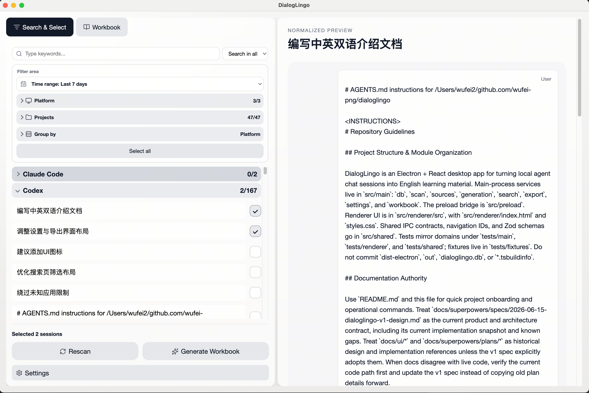
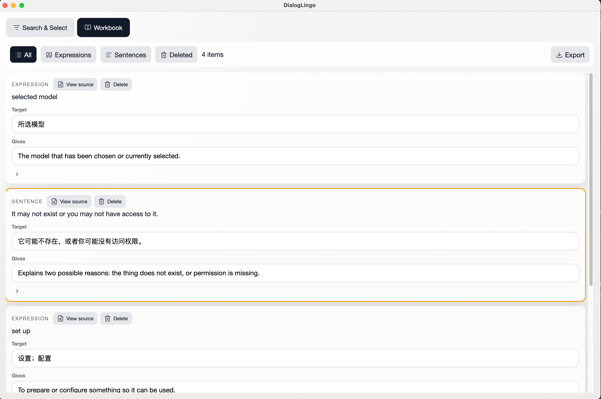
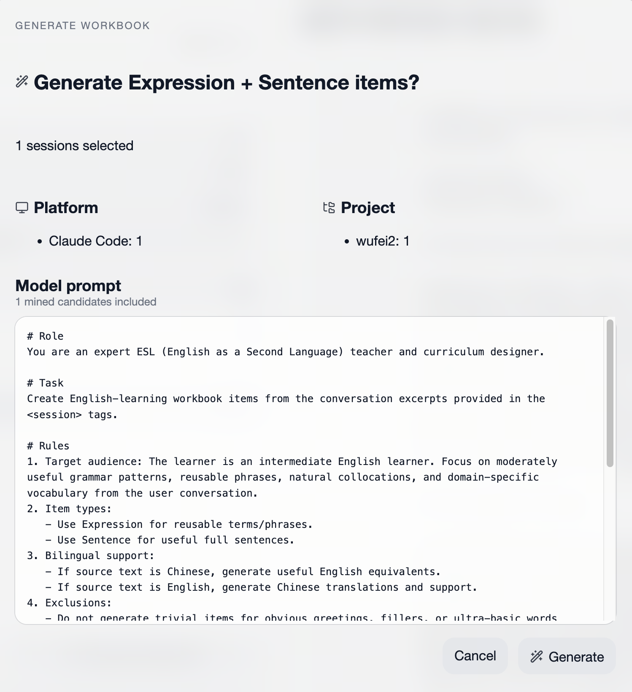
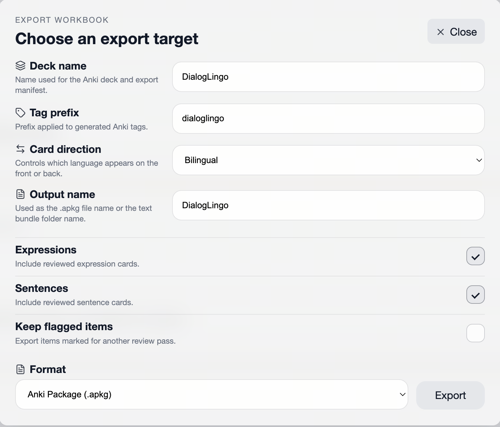

# DialogLingo

<p align="center">
  
</p>

[中文版](README_CN.md) | English

DialogLingo turns local AI-agent chat history into reviewable English learning workbooks and Anki-ready decks.

If English is currently the smoothest way to work with AI agents, your everyday conversations with tools like Codex, Claude Code, and OpenCode already contain useful learning material. DialogLingo pulls those local conversations into a desktop app, lets you select the sessions that matter, generates `Expression` and `Sentence` study items, and exports the result to Anki or text bundles.

## Why This Exists

Most language-learning apps give you generic examples. DialogLingo starts from the conversations you already have while building, debugging, and asking agents for help. The goal is not to become another spaced-repetition system. The goal is a focused local pipeline:

```text
local sessions -> selection -> generation -> review workbook -> export
```

You review and clean the generated workbook in DialogLingo, then study it in Anki or another downstream tool.

## Screenshots

### Search and Select



### Workbook Review



### Editable Generation Prompt



### Export Options



## Features

- **Local session discovery**: indexes local Codex, Claude Code, and OpenCode histories from their default paths.
- **Search and selection workflow**: filter by time range, platform, project, title, or transcript content before generating.
- **Workbook generation**: creates two study item types, `Expression` and `Sentence`, from mixed-language AI conversations.
- **Editable prompt preview**: shows the generated model prompt before a run, so you can adjust the extraction request.
- **Noise-aware pipeline**: pre-cleans tool output, logs, code blocks, path fragments, and obvious secret-like strings before model calls.
- **Review-first workbook**: edit, delete, restore, revert, and inspect source provenance before exporting.
- **Anki-first export**: exports `.apkg`, Anki text bundles, and generic text bundles with deck name, direction, tag, and item-type options.
- **Narrow model surface**: supports an OpenAI-compatible API endpoint plus explicit local CLI backends for Codex, Claude, and OpenCode.
- **Local-first privacy posture**: indexing stays local; remote generation requires explicit provider configuration.
- **English and Simplified Chinese UI**: the app includes both English and Chinese interface text.

## Installation

Recommended: download the installer for your platform from the GitHub Releases page:

[https://github.com/wufei-png/dialoglingo/releases](https://github.com/wufei-png/dialoglingo/releases)

Use the source workflow only when you want the latest unreleased changes or local development.

Requirements:

- Node.js `24.15.0`
- npm
- Local chat history from at least one supported agent tool

```bash
git clone https://github.com/wufei-png/dialoglingo.git
cd dialoglingo
nvm use
npm install
npm run dev
```

To try the workbook UI without calling a remote API or local CLI model backend:

```bash
npm run dev:mock-llm
```

In the app, open `Settings` to configure either an OpenAI-compatible API endpoint or one of the supported CLI backends.

## Local Packaging

```bash
npm run package:mac
npm run package:win
npm run package:linux
```

Use the platform command that matches your machine. The package scripts build the Electron app and verify packaging inputs before creating local artifacts.

## Development

Common commands:

```bash
npm run dev
npm run dev:mock-llm
npm run typecheck
npm test
npm run build
```

The current product and architecture contract lives in:

- [DialogLingo v1 Design](docs/superpowers/specs/2026-06-15-dialoglingo-v1-design.md)
- [Generation Pre-clean and Candidate Mining](docs/architecture/2026-06-18-generation-preclean-candidate-mining.md)

## Native Module ABI Note

`better-sqlite3` has separate Node and Electron ABI builds in this repo.

- `npm run build` and `npm run dev` run `prepare:native:electron`, which rebuilds the Electron ABI copy used by the Electron main process.
- Vitest and other plain Node commands need the Node ABI copy.
- If a Node test fails with `NODE_MODULE_VERSION` after a build, refresh the Node ABI and snapshot before testing:

```bash
npm run rebuild:native:node
npm run capture:native:node
npm run test -- --run
```

Do not remove the Electron rebuild step. The detailed policy lives in [Electron stack version decision](docs/architecture/2026-06-15-electron-stack-version-decision.md).

## Project Address

[https://github.com/wufei-png/dialoglingo](https://github.com/wufei-png/dialoglingo)

## Star History

[](https://star-history.com/#wufei-png/dialoglingo&Date)

## License

MIT
