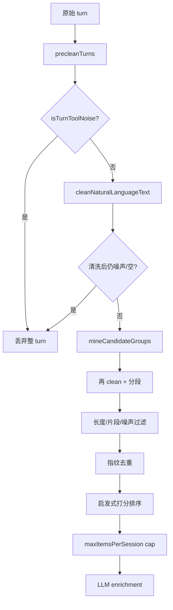

# Generation Pre-clean and Candidate Mining

This document describes the current local heuristic pipeline that runs before LLM enrichment. It applies to pipeline steps `pre-clean` and `candidate mining` in the v1 generation flow.

Search indexing keeps raw transcript text. This pipeline only affects generation prompts and mined candidates.

## Pipeline overview

Design stance: **conservative filtering**. Prefer dropping noisy transcript material over sending code, logs, tool output, or path fragments to the model. Remaining edge cases are expected to be handled by later ranking, LLM enrichment, and manual workbook review.

## Module map

| Module | Role |
|--------|------|
| `src/main/text/turnNoise.ts` | Shared regex/heuristic rules: secret redaction, noisy-line detection, pure-noise turn classification, natural-language cleanup |
| `src/main/generation/preclean.ts` | Turn-level entry: `precleanTurns` drops pure-noise turns and strips noisy lines from mixed turns |
| `src/main/generation/candidates.ts` | Candidate entry: `mineCandidateGroups` segments cleaned text, filters fragments, deduplicates, and ranks excerpts |
| `src/main/generation/promptPreview.ts` | Preview path: `precleanTurns` → `mineCandidateGroups` → `maxItemsPerSession` |
| `src/main/generation/worker.ts` | Runtime generation path with the same ordering |

Adapter-provided `isToolNoise` on `ConversationTurn` is the most reliable discard signal. Heuristics in `turnNoise.ts` are a fallback when adapters do not mark tool/meta output explicitly.

## Pre-clean (`precleanTurns`)

1. Drop the whole turn when `isToolNoise === true` or `isLikelyPureNoiseText` says the turn is pure tool/code/log/path/error noise.
2. Otherwise run `cleanNaturalLanguageText`:
   - redact obvious `sk-*` secrets to `[redacted-secret]`
   - remove fenced code blocks
   - for mixed turns, delete noisy lines but keep natural-language lines
3. Drop the turn again if cleaning leaves empty or still-pure-noise text.

## Candidate mining (`mineCandidateGroups`)

Operates on turns that survived pre-clean:

1. **Segment** — split on blank lines; merge single newlines into paragraphs; chunk long paragraphs near 360 characters by sentence boundaries.
2. **Filter** — require natural-language signal and minimum length (English ≥ 12 chars, CJK ≥ 6 chars); drop pure URL/path/hash/shell fragments and obvious noise segments.
3. **Deduplicate** — normalized fingerprint plus conservative near-duplicate detection (substring overlap with length ratio > 0.85).
4. **Rank** — lightweight heuristic score (length, language density, technical terms, symbol penalty).
5. **Cap** — `maxItemsPerSession` is applied after filtering and ranking, not on raw turn count.

## Tests

- `tests/main/generation/preclean.test.ts` — noise stripping and pure-turn drops
- `tests/main/generation/redaction.test.ts` — secret redaction only
- `tests/main/generation/candidates.test.ts` — segmentation, fragment filtering, near-duplicate collapse
- `tests/main/generation/prompt-preview.test.ts` — end-to-end filtered prompt preview

## Known limitations

- Heuristic thresholds are pragmatic, not formally proven. False positives (dropping useful short phrases) and false negatives (leaking unfenced code or non-`sk-*` secrets) are possible.
- Regex rules for paths, shell commands, and logs are duplicated in part between `turnNoise.ts` and `candidates.ts`; keep them aligned when editing.
- Real-transcript fixture regression is follow-up work. See `docs/superpowers/plans/2026-06-18-dialoglingo-v1-follow-up-todo.md`.
